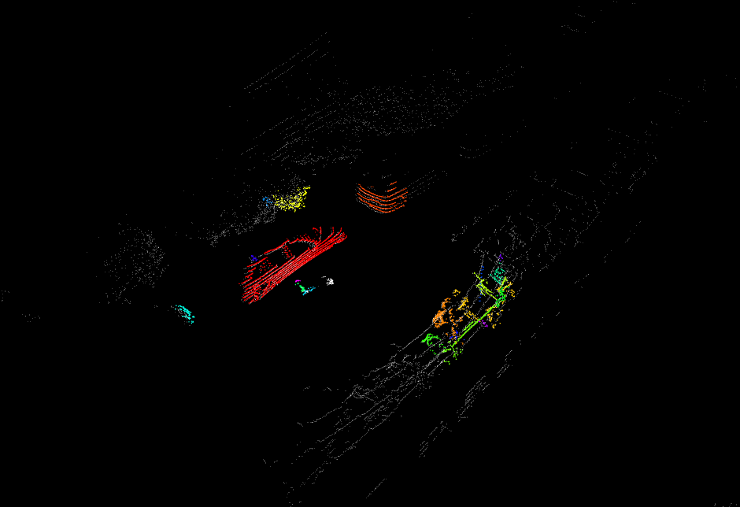

## Curved-Voxel Clustering Algorithm for 3D LiDAR Point Clouds
An ROS implementation for paper "Curved-Voxel Clustering for Accurate Segmentation of 3D LiDAR Point Clouds with Real-Time Performance"

## Features
* New Spatial Primitive. curved-voxel, a LiDAR-optimized spatial unit reflecting distinct characteristics of 3D LiDAR point clouds. 
* Algorithm. an efficient method for segmenting 3D LiDAR point clouds by utilizing LiDAR-optimized curved-voxels and efficient hashbased data structure.
* using autoware_msg to pass the segemntation result

## Reference
* Curved-Voxel Clustering for Accurate Segmentation of 3D LiDAR Point Clouds with Real-Time Performance. (IROS) 2019
* https://github.com/wangx1996/Lidar-Segementation
* https://github.com/SS47816/lidar_obstacle_detector

**TODOs**
* imporove the efficiency of algorithm
* imporove the segmentation accuracy

**Known Issues**
* the segementation result is not very ideal.

## Dependencies
* ground point filter such as https://github.com/AbangLZU/plane_fit_ground_filter to produce the topic "/points_no_ground"
* autoware-msgs
* pcl

## How to use
    # clone the repo
    mkdir -p catkin_ws/src
    cd catkin_ws/src
    git clone https://github.com/N-Ding/Curved-Voxel-Clustering-for-3D-Lidar
    cd ../
    catkin_make 
    roslaunch cvc_segment_origin cvc_segment_origin.launch
## Connect me
If you have any problems or ideal to share with, please leave it in Issues part or connet me dircetly, my email is "hmx_2013@outlook.com"

## Contribution
You are welcome contributing to the package by opening a pull-request

We are following: 
[Google C++ Style Guide](https://google.github.io/styleguide/cppguide.html), 
[C++ Core Guidelines](https://isocpp.github.io/CppCoreGuidelines/CppCoreGuidelines#main), 
and [ROS C++ Style Guide](http://wiki.ros.org/CppStyleGuide)

## License
MIT License
